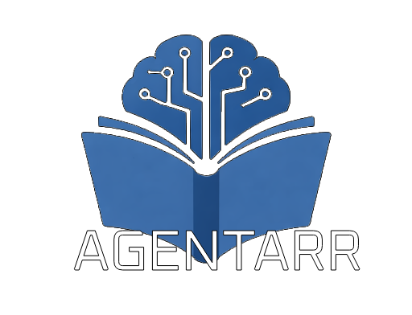

<div align="center">
  
</div>

Agentarr is an AI-powered media management application that integrates with popular media automation tools like Sonarr, Radarr, Prowlarr, and Jellyfin. It provides an intelligent interface for managing your media library with AI agents that can automatically add series, movies, and organize files.

## Features

- 🤖 **AI-Powered Agents**: Automatically add series and movies using natural language queries
- 📺 **Series Management**: Integrate with Sonarr for TV series tracking and management
- 🎬 **Movie Management**: Integrate with Radarr for movie collection management
- 🔍 **Indexer Integration**: Connect with Prowlarr for search index management
- 🎥 **Media Server**: Integrate with Jellyfin for media library access
- 📁 **File Organization**: AI agents can automatically move and organize media files
- 🎨 **Modern UI**: Built with SvelteKit and Tailwind CSS for a beautiful, responsive interface

## Startup Guide

1. Copy the `.env.example` to `.env` and fill in the environment variables:

   ```bash
   cp .env.example .env
   ```

2. Start the Docker container:

   ```bash
   docker compose up -d
   ```

3. The app will be available at http://localhost:5173


## Contributing

Contributions are welcome! Please feel free to submit a Pull Request.

## License

This project is licensed under the MIT License - see the [LICENSE](LICENSE) file for details.
